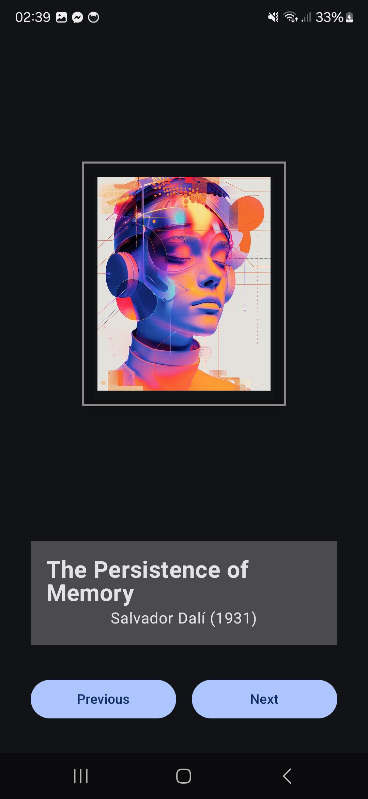
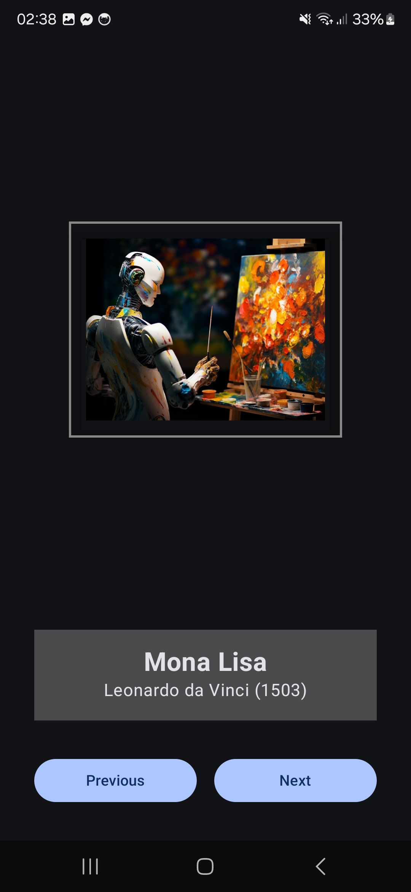
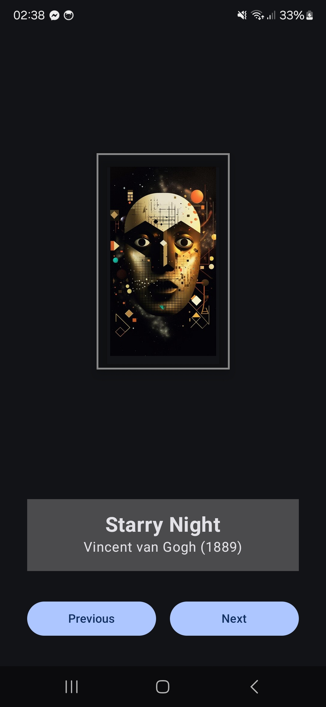

# Art Space Android App

## Overview
Art Space is a simple Android application built with Jetpack Compose that displays a collection of artwork. Users can navigate through the collection using "Previous" and "Next" buttons, viewing the artwork image along with its title, artist, and year.





## Features
- Display artwork images in a frame-like presentation
- Show artwork information (title, artist, year)
- Navigate between artworks with Previous and Next buttons
- Circular navigation (wraps around when reaching the first or last artwork)

## Technologies Used
- Kotlin
- Jetpack Compose
- Android Studio
- Material Design 3

## Project Structure
- `MainActivity.kt`: The main entry point of the application
- `Artwork.kt`: Data class to represent artwork information
- `res/drawable/`: Contains artwork images

## Getting Started

### Prerequisites
- Android Studio (Arctic Fox or newer)
- Android SDK 21 or higher
- Kotlin 1.5.0 or higher

### Installation
1. Clone the repository:
   ```
   git clone https://github.com/yourusername/Art-Space.git
   ```
2. Open the project in Android Studio
3. Build and run the application on an emulator or physical device


## Contact
Your Name - [ranim.bouchoucha@sesame.com.tn](mailto:your.email@example.com)

Project Link: [https://github.com/B-Ranym/Art-Space](https://github.com/yourusername/art-space)
